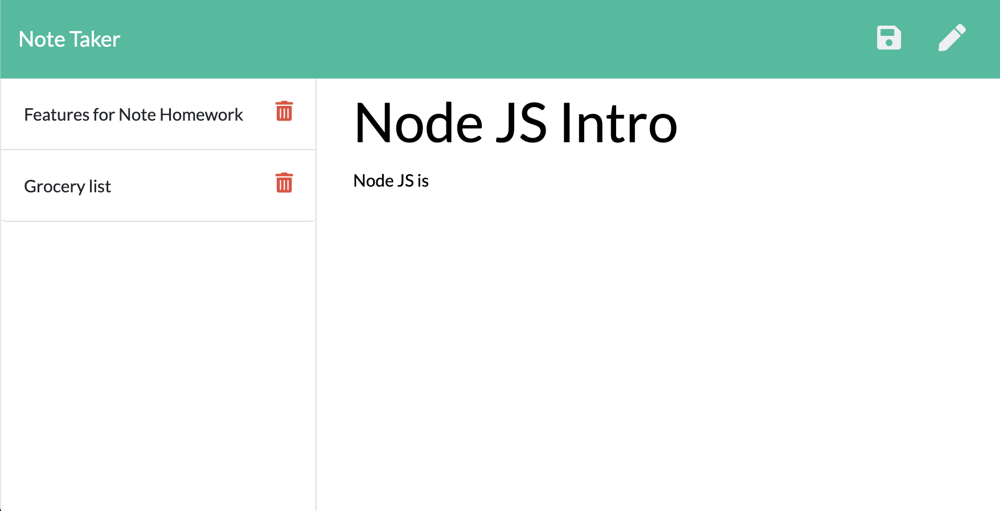

# Note-Taker

## Description

This is a note writing application. This application is used to write, save, and delete notes. It uses an express backend to save and retreive information from a JSON file.

## Table of Contents

* [Description](#description)
* [User Story](#user-story)
* [Installation](#installation)
* [Usage](#usage)
* [License](#license)
* [Contributing](#contributing)
* [Tests](#tests)
* [Questions](#questions)
* [Deployed Application URL](#deployed-application-URL)

## User Story

AS A user, I want to be able to write and save notes. I WANT to be able to delete notes I've written before, SO THAT I can organize my thoughts and keep track of tasks I need to complete.

## Installation

No installation needed. Once you click the deployed application link, it is ready to go.

## Usage

The deployed application link will take you to the homepage. Click on get started to begin typing your notes. To begin writing your note, click on Note title to write the title of your note and then click on note text to write the contents of your note. Click on the save icon to save your note on the left side of the application. You can click on the delete icon in order to delete the note. Lastly, to view the note, you can click on any saved note to view the note and then click on the pencil icon to write a new note.

## License

## Contributing

Please follow standard contributing guidelines.

## Tests

No tests to run.

## Questions

For any questions, please contact kendayao at kendayao@gmail.com

## Deployed Application URL

None
